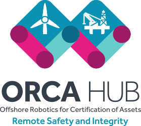

The Autonomy and Verification Laboratory is involved in three Robotics and Artificial Intelligence hubs. Each hub focusses on autonomous robotics in a different hazardous environment: the [RAIN Hub](http://rainhub.org.uk/) in nuclear robotics, the [ORCA Hub](https://orcahub.org/) in robotics offshore  and the [FAIR-SPACE Hub](https://www.fairspacehub.org/) in robots in space.

### Robotics and Artificial Intelligence Verification

These three research hubs are part of funding from the [UK Research and Innovation Industrial Strategy Fund](https://www.ukri.org/innovation/industrial-strategy-challenge-fund/) to tackle societal and industrial challenges. The original [funding call](https://www.epsrc.ac.uk/funding/calls/raihubs/) describes the hubs' aims as being to "develop robotic solutions to make a safer working environment" for industries like off-shore energy, nuclear energy, and space. Crucially, this requires cross-disciplinary research, which is why each hub has a variety of academic and industrial partners.

Each of these environments might be dull or dirty; and the environments themselves are often dangerous or distant. Dull jobs lead to mistakes; dangerous and dirty jobs are harmful to humans or the environment; and distant jobs make remote control tricky or impossible. Increasing the autonomy of robots in these environments, and the environments themselves, provide challenges for our research; which is generally focussed on verification of the safety of these robotic systems.

Despite the differences between the environments and use cases of the three hubs that the A&V Lab is involved with, a lot of our work is relevant to all three hubs. The issue of __explainable__ autonomy is crucial to each of the hubs, and we are involved in developing techniques to verify autonomous and reconfigurable systems that operate in dangerous environments.

### Robotics and AI In Nuclear 

 

The Robotics and AI In Nuclear (RAIN) Hub aims to tackle the challenges of increasing the level of autonomy of robotic systems within the UK's civilian nuclear industry. 

Major challenges:

* Unseen hazards (i.e. radiation)
* Lack of human intervention (because of radiation)
* Needfully strict certification requirements

Activities:

* Heterogeneous specification of component-based systems (STRANDS)
* Verifiable Monitors
* Future of Nuclear Certification Workshops
* Verification of plans
* Verification of reconfiguration

More information can be found on the [RAIN Hub website](http://rainhub.org.uk/).

### Offshore Robotics for Certification of Assets

 

The Offshore Robotics for Certification of Assets (ORCA) Hub aims to enable autonomous robotic systems for inspecting offshore assets, such as wind turbines and oil rigs.

Major Challenges:

* Quickly Changing environment, due to wind and sea state
* Unseen hazards (i.e. wind)

Activities:

* Predicting and planning around wind hazards
* Heterogeneous specification of component-based systems (Nessie)
* Verification of plans

More information can be found on the [ORCA Hub website](https://orcahub.org/).

### Future AI and Robotics for Space

The Future AI and Robotics for Space (FAIR SPACE) Hub aims to develop autonomous robotic systems for use in space exploration. 

Major Challenges:

* Lack of human intervention (because of space)
* Communications delay due to distance
* Expensive
* Potential human risk

Activities: 

* Verification of safety properties

More information can be found on the [FAIR-SPACE Hub website](https://www.fairspacehub.org/).

